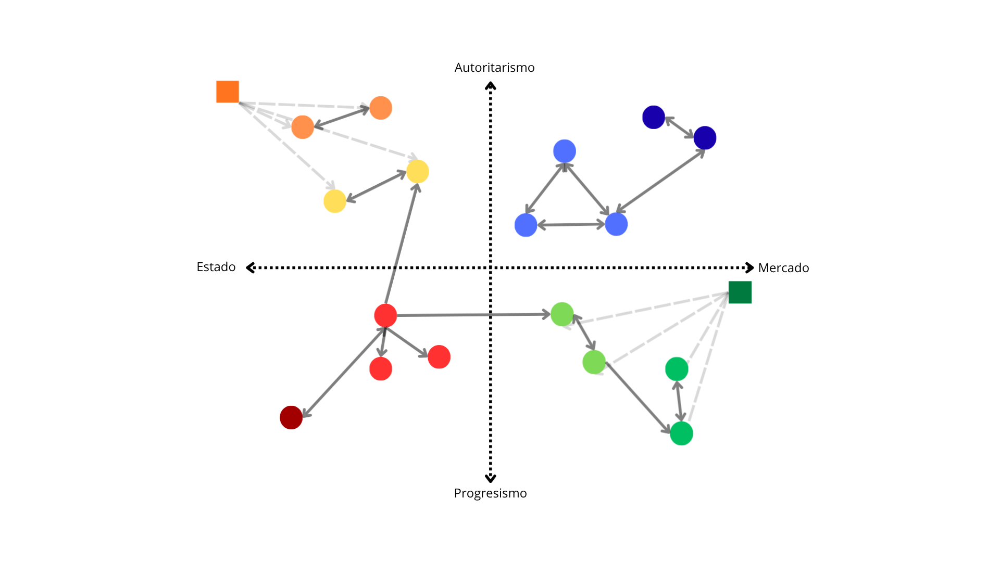
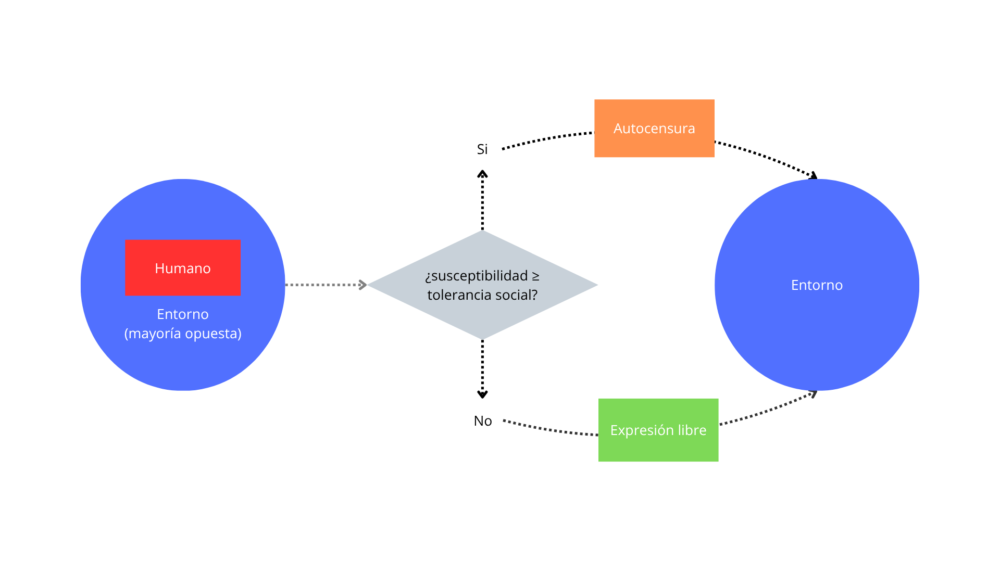
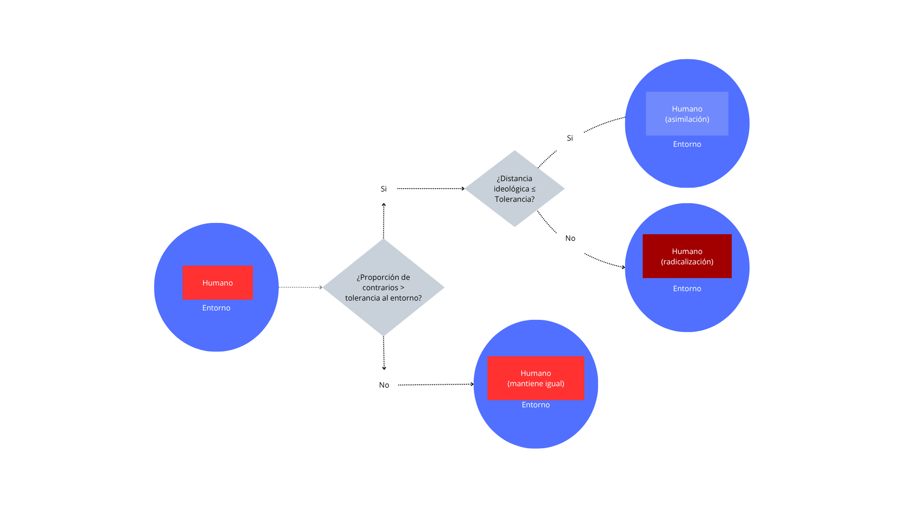
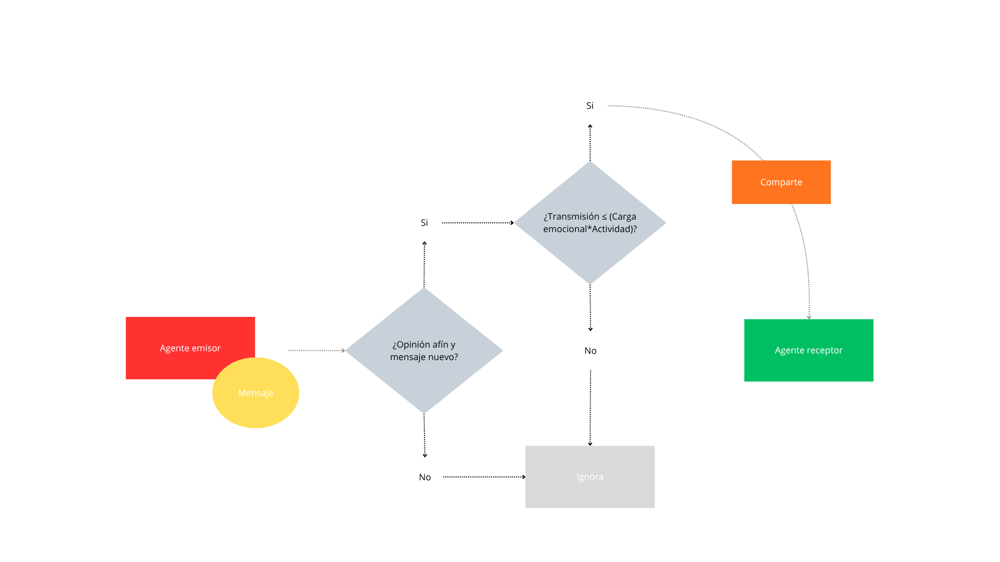

## El nuevo escenario de la opinión pública
- Cuarta ola de la democracia digital: big data, [IA]{.bot} y *fake news*. 
- [Adaptación de la interacción]{.humano} a espacios online. 
- Aislamiento grupal por [estructuras algorítmicas]{.imp}.

## Irrupción de los bots en redes sociales
- [Bots políticos:]{.bot} *zealots* artificiales.
- Modus operandi: *astroturfing*.
- [Amplificadores emocionales]{.imp}.

## Objetivos de investigación
Evaluar la influencia de los [bots políticos]{.bot} en las [decisiones electorales]{.humano} de los usuarios de redes digitales:

- Identificar las dinámicas [usuario]{.humano}-[contenido]{.info}.
- Analizar cambios de decisión electoral.
- Analizar las dinámicas [bot]{.bot}-[usuario]{.humano}.
- Contrastar la relación entre opinión personal y su decisión electoral.

## Agentes del modelo
- [Humano:]{.humano} Opinión, decisión electoral, susceptibilidad y tolerancia.
- [Bot:]{.bot} Opinión fija y alta actividad.
- [Información:]{.info} Ideología y carga emocional.

## Entorno digital

{.r-stretch fig-align="center"}
 
## Regla 1 - Decisión electoral pública

{.r-stretch fig-align="center"}

## Regla 2 - Actualización de Opinión

{.r-stretch fig-align="center"}

## Regla 3 - Propagación de información

{.r-stretch fig-align="center"}

## Método: Escenarios de simulación
1. Control: [red orgánica]{.humano}.
2. [Densidad de bots:]{.bot} infiltración progresiva hasta 40%.
3. Tolerancia y susceptibilidad [variable]{.imp}.

## Pasos a seguir
- **Corto-plazo:** fortalecimiento de los antecendentes con teoría sociológica sustantiva.
- **Mediano-plazo:** creación de la simulación en sí. 
- **Largo-plazo:** validación empírica del modelo con datos de encuestas de preferencia electoral.

# **Gracias**

::: {style="text-align: center;"}
**Felipe Vega Gandolfo** 
Universidad de Chile
:::